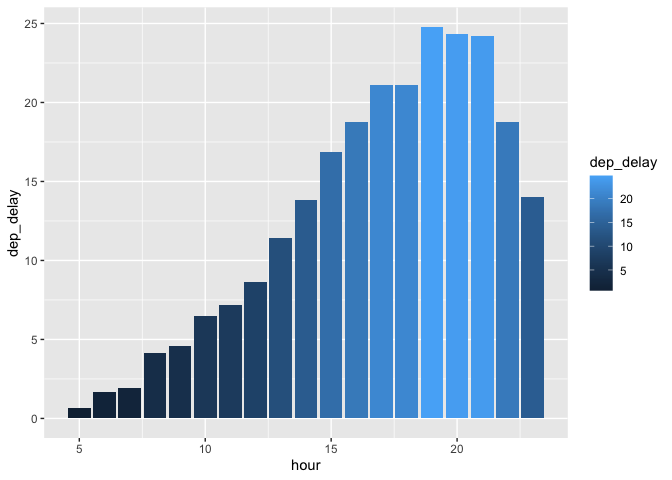
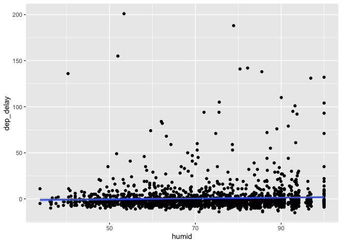
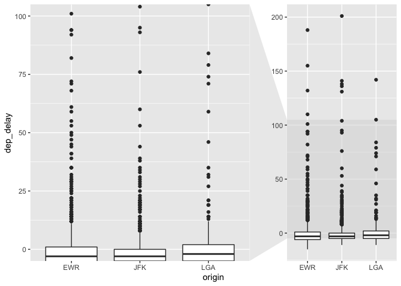

HW3
================
Yue Yin
October 3, 2021

``` r
library(dplyr)
```

    ## 
    ## Attaching package: 'dplyr'

    ## The following objects are masked from 'package:stats':
    ## 
    ##     filter, lag

    ## The following objects are masked from 'package:base':
    ## 
    ##     intersect, setdiff, setequal, union

``` r
library(nycflights13)
library(ggplot2)
library(ggforce)
```

### Introduction

Pattern 1: Morning is the best time to fly without much delay.

Pattern 2: It might be better to fly in the morning when relative
humidity is low.

Pattern 3: It might be better to fly from JFK airport in the morning.

``` r
cor(flights$hour, flights$dep_delay, use='complete.obs')
```

    ## [1] 0.1982259

``` r
flights %>% 
  group_by(hour) %>% 
  summarise(dep_delay = mean(dep_delay, na.rm = T)) %>% 
  arrange(dep_delay) %>% 
  ggplot(aes(hour, dep_delay, fill = dep_delay)) + geom_col()
```

    ## `summarise()` ungrouping output (override with `.groups` argument)

    ## Warning: Removed 1 rows containing missing values (position_stack).

<!-- -->

7pm is the time period with the longest mean departure delay, 5am is the
time period with the shortest mean departure delay. So it might be
better to fly in the morning to avoid delays.

Next, select all the rows with departure hour of 5.

``` r
flights_weather <- flights %>%
  inner_join(weather, by = c("origin", "time_hour")) 
cor(flights_weather$humid,flights_weather$dep_delay,use='complete.obs')
```

    ## [1] 0.1174944

``` r
flights_weather %>% 
  filter(hour.x == 5) %>% 
  ggplot(mapping = aes(x = humid, y = dep_delay)) + 
  geom_point() +
  geom_smooth(method = "lm")
```

    ## `geom_smooth()` using formula 'y ~ x'

    ## Warning: Removed 9 rows containing non-finite values (stat_smooth).

    ## Warning: Removed 9 rows containing missing values (geom_point).

<!-- -->

Relative humidity is weakly related to the delay time when the departure
hour is 5, and higher humidity to some degree causes longer departure
delay.

``` r
lm <- lm(dep_delay ~ origin, data = flights)
summary(lm)
```

    ## 
    ## Call:
    ## lm(formula = dep_delay ~ origin, data = flights)
    ## 
    ## Residuals:
    ##     Min      1Q  Median      3Q     Max 
    ##  -55.11  -17.35  -14.11   -2.11 1288.89 
    ## 
    ## Coefficients:
    ##             Estimate Std. Error t value Pr(>|t|)    
    ## (Intercept)  15.1080     0.1171  129.00   <2e-16 ***
    ## originJFK    -2.9958     0.1687  -17.76   <2e-16 ***
    ## originLGA    -4.7611     0.1721  -27.67   <2e-16 ***
    ## ---
    ## Signif. codes:  0 '***' 0.001 '**' 0.01 '*' 0.05 '.' 0.1 ' ' 1
    ## 
    ## Residual standard error: 40.16 on 328518 degrees of freedom
    ##   (8255 observations deleted due to missingness)
    ## Multiple R-squared:  0.002411,   Adjusted R-squared:  0.002405 
    ## F-statistic: 396.9 on 2 and 328518 DF,  p-value: < 2.2e-16

``` r
flights %>% 
  filter(hour == 5) %>%
  ggplot(mapping = aes(x = origin, y = dep_delay)) + 
  geom_boxplot() +
  facet_zoom(ylim = c(0, 100))
```

    ## Warning: Removed 9 rows containing non-finite values (stat_boxplot).

<!-- -->

The origin is significant in predicting departure delay, and JFK may be
the airport with overall shorter departure delay when departure hour is
5.

GitHub link: <https://github.com/Jennyyin20/myrepo>
