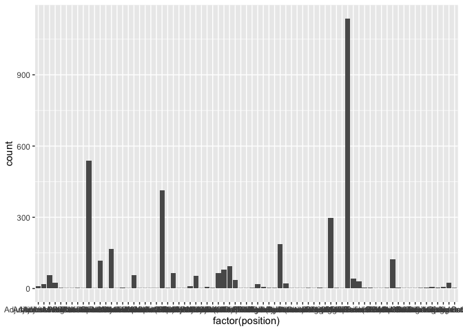

HW1
================
Yue Yin
September 16, 2021

``` r
library(tidyverse)
```

    ## ── Attaching packages ──────────────────────────────────────── tidyverse 1.3.0 ──

    ## ✓ ggplot2 3.3.2     ✓ purrr   0.3.4
    ## ✓ tibble  3.0.3     ✓ dplyr   1.0.2
    ## ✓ tidyr   1.1.2     ✓ stringr 1.4.0
    ## ✓ readr   2.0.1     ✓ forcats 0.5.0

    ## ── Conflicts ─────────────────────────────────────────── tidyverse_conflicts() ──
    ## x dplyr::filter() masks stats::filter()
    ## x dplyr::lag()    masks stats::lag()

``` r
library(rvest)
```

    ## Loading required package: xml2

    ## 
    ## Attaching package: 'rvest'

    ## The following object is masked from 'package:purrr':
    ## 
    ##     pluck

    ## The following object is masked from 'package:readr':
    ## 
    ##     guess_encoding

``` r
library(stringr)
library(readr)
library(XML)
```

    ## 
    ## Attaching package: 'XML'

    ## The following object is masked from 'package:rvest':
    ## 
    ##     xml

``` r
library(ggplot2)
```

``` r
webpage <- read_html("https://guide.wisc.edu/faculty/")
xml_find_all(webpage, ".//br") %>% xml_add_sibling("p", "\n")
xml_find_all(webpage, ".//br") %>% xml_remove()
faculty <- html_nodes(webpage, "li")[13:3801]
faculty <- html_text(faculty)
df <- as.data.frame(faculty)
final_df <- as.data.frame(str_split_fixed(df$faculty, "\n", 4))
colnames(final_df) <- c("name","position","department","degree information")
final_df$`degree information` <- gsub("\n","", final_df$`degree information`)
```

``` r
str(final_df)
```

    ## 'data.frame':    3789 obs. of  4 variables:
    ##  $ name              : chr  "ABBOTT,DAVID H." "ABD-ELSAYED,ALAA A" "ABDUALLAH,FAISAL" "ABRAHAM,OLUFUNMILOLA" ...
    ##  $ position          : chr  "Professor" "Assoc Professor (Chs)" "Professor" "Assistant Professor" ...
    ##  $ department        : chr  "Obstetrics & Gynecology" "Anesthesiology" "Art" "Pharmacy" ...
    ##  $ degree information: chr  "PHD 1979 University of Edinburgh" "MD 2000 University of Assiut" "PHD 2012 Royal College of Art" "PHD 2013 Univ of Wisconsin-Madison" ...

``` r
head(final_df)
```

    ##                   name              position              department
    ## 1      ABBOTT,DAVID H.             Professor Obstetrics & Gynecology
    ## 2   ABD-ELSAYED,ALAA A Assoc Professor (Chs)          Anesthesiology
    ## 3     ABDUALLAH,FAISAL             Professor                     Art
    ## 4 ABRAHAM,OLUFUNMILOLA   Assistant Professor                Pharmacy
    ## 5      ABRAMS,SAMANTHA        Assoc Lecturer      Information School
    ## 6         ABRAMSON,LYN             Professor              Psychology
    ##                    degree information
    ## 1    PHD 1979 University of Edinburgh
    ## 2        MD 2000 University of Assiut
    ## 3       PHD 2012 Royal College of Art
    ## 4  PHD 2013 Univ of Wisconsin-Madison
    ## 5   MA 2017 Univ of Wisconsin-Madison
    ## 6 PHD 1978 University of Pennsylvania

``` r
tail(final_df)
```

    ##                        name            position            department
    ## 3784        ZUMBRUNNEN,JOHN           Professor     Political Science
    ## 3785 ZUMWALDE,NICHOLAS ALAN  Asst Faculty Assoc              Genetics
    ## 3786     ZURAWSKI,SARAH ANN            Lecturer           Kinesiology
    ## 3787             ZWASKA,AMY      Assoc Lecturer Counseling Psychology
    ## 3788           ZWECK,JORDAN Associate Professor               English
    ## 3789        ZWEIBEL,ELLEN G           Professor             Astronomy
    ##                          degree information
    ## 3784 PHD 2000 Univ of Minnesota-Twin Cities
    ## 3785 PHD 2013 Univ of Minnesota-Twin Cities
    ## 3786   MS 2010 Univ of Wisconsin-Whitewater
    ## 3787   MS 1996 Univ of Wisconsin-Whitewater
    ## 3788               PHD 2010 Yale University
    ## 3789          PHD 1977 Princeton University

``` r
final_df %>% count(department, sort = T)
```

    ##                         department   n
    ## 1                       Law School 123
    ## 2                          Nursing  92
    ## 3                      Mathematics  90
    ## 4                          English  83
    ## 5                         Medicine  83
    ## 6                      Social Work  79
    ## 7                         Pharmacy  73
    ## 8                Computer Sciences  65
    ## 9                        Chemistry  62
    ## 10                         History  60
    ## 11                Medical Sciences  59
    ## 12           Counseling Psychology  58
    ## 13      Electrical & Computer Engr  57
    ## 14               Surgical Sciences  56
    ## 15     Mead Witter School Of Music  54
    ## 16                         Physics  54
    ## 17                             Art  52
    ## 18      Curriculum And Instruction  52
    ## 19      Civil & Environmental Engr  49
    ## 20                      Pediatrics  48
    ## 21                       Economics  47
    ## 22          Mechanical Engineering  47
    ## 23                      Psychology  46
    ## 24                     Kinesiology  44
    ## 25         German, Nordic & Slavic  42
    ## 26              Information School  41
    ## 27                    Biochemistry  40
    ## 28             Integrative Biology  39
    ## 29         School Of Human Ecology  38
    ## 30   Communication Sci & Disorders  36
    ## 31   Engr Professional Development  36
    ## 32        Pathobiological Sciences  36
    ## 33                Academic Affairs  35
    ## 34          Educational Psychology  35
    ## 35               Political Science  35
    ## 36                      Statistics  35
    ## 37   Ed Leadership&Policy Analysis  34
    ## 38              Accting & Info Sys  32
    ## 39       Animal And Dairy Sciences  32
    ## 40                       Sociology  32
    ## 41                       Geography  31
    ## 42      Asian Languages & Cultures  28
    ## 43          Biomedical Engineering  28
    ## 44              Communication Arts  28
    ## 45             Engineering Physics  28
    ## 46                 Family Medicine  28
    ## 47       Industrial & Systems Engr  28
    ## 48                      Geoscience  27
    ## 49          Spanish And Portuguese  27
    ## 50                         Surgery  27
    ## 51                         Finance  26
    ## 52       Planning & Landscape Arch  26
    ## 53               Academic Programs  25
    ## 54                    Bacteriology  25
    ## 55                          Botany  25
    ## 56       Forest & Wildlife Ecology  25
    ## 57  Lafollette Sch Of Publ Affairs  25
    ## 58                       Marketing  25
    ## 59  Agricultural&Applied Economics  24
    ## 60   Biostatistics&Med Informatics  24
    ## 61      Chemical & Biological Engr  24
    ## 62                           Dance  24
    ## 63                        Genetics  24
    ## 64   Journalism&Mass Communication  24
    ## 65                 Medical Physics  23
    ## 66      Population Health Sciences  23
    ## 67         Comparative Biosciences  22
    ## 68    Management & Human Resources  22
    ## 69            Nutritional Sciences  22
    ## 70                      Psychiatry  22
    ## 71        Gender And Women Studies  20
    ## 72   Materials Science&Engineering  20
    ## 73  Ms In Biotechnology Degree Prg  20
    ## 74                        Oncology  20
    ## 75                      Philosophy  20
    ## 76   Rehab Psychology & Special Ed  20
    ## 77                 Theatre & Drama  20
    ## 78                    Anthropology  19
    ## 79  Atmospheric & Oceanic Sciences  19
    ## 80      Department Of Neuroscience  19
    ## 81              French And Italian  19
    ## 82                    Horticulture  19
    ## 83   Pathology&Laboratory Medicine  19
    ## 84                       Astronomy  18
    ## 85   Cell And Regenerative Biology  18
    ## 86                 Plant Pathology  18
    ## 87  Biological Systems Engineering  17
    ## 88      Educational Policy Studies  17
    ## 89   Real Estate & Urgan Land Econ  17
    ## 90     Life Sciences Communication  16
    ## 91                       Neurology  16
    ## 92   Operations & Information Mgmt  16
    ## 93                       Radiology  16
    ## 94         Obstetrics & Gynecology  15
    ## 95                    Soil Science  15
    ## 96          Biomolecular Chemistry  14
    ## 97                    Food Science  14
    ## 98                        Agronomy  13
    ## 99                     Art History  13
    ## 100  Classic & Ancient Near E Stds  13
    ## 101               Consumer Science  13
    ## 102               Risk & Insurance  13
    ## 103                 Design Studies  12
    ## 104  Ophthalmology&Visual Sciences  12
    ## 105   Wisconsin School Of Business  12
    ## 106                     Entomology  11
    ## 107           Medical Microbiology  11
    ## 108           Neurological Surgery  11
    ## 109                Volunteer Staff  11
    ## 110       African Cultural Studies  10
    ## 111          Afro-American Studies  10
    ## 112  Community & Environ Sociology  10
    ## 113    South Asian Sum Lang Instit  10
    ## 114                 Anesthesiology   9
    ## 115 Orthopedics And Rehabilitation   9
    ## 116             Emergency Medicine   8
    ## 117                 Human Oncology   8
    ## 118               Military Science   8
    ## 119                  Asian Studies   7
    ## 120  Dept Of Med History&Bioethics   7
    ## 121          Inst Reg Intl Studies   7
    ## 122                      Wiscience   7
    ## 123          Cals Academic Affairs   6
    ## 124                    Dermatology   6
    ## 125          Ft Mba Program Office   6
    ## 126                    Amer Ind St   5
    ## 127 Ctr For Rus East Eur Cent Asia   5
    ## 128       Disease Prevention Admin   5
    ## 129      Language Sciences Program   5
    ## 130                  Naval Science   5
    ## 131                   Religious St   5
    ## 132                        Urology   5
    ## 133        Biology Core Curriculum   4
    ## 134              Ctr For Jewish St   4
    ## 135    Engineering Research Center   4
    ## 136 Engineering Student Developmnt   4
    ## 137 Human Development&Family Study   4
    ## 138       Law, Society And Justice   4
    ## 139 Liberal Arts & Applied Studies   4
    ## 140   Madison Pathology/Toxicology   4
    ## 141   Se Asian Summer Studies Inst   4
    ## 142             Acad&Prg-Noncredit   3
    ## 143 Admin:Student Academic Affairs   3
    ## 144            Air Force Aerospace   3
    ## 145                  Asian Amer St   3
    ## 146 Civil Society And Comm Studies   3
    ## 147          Ev Mba Program Office   3
    ## 148          Ex Mba Program Office   3
    ## 149         General Administration   3
    ## 150  Vp Diversity And Climate Prog   3
    ## 151                           #N/A   2
    ## 152                 Administration   2
    ## 153             Bba Program Office   2
    ## 154     Bolz Center For Arts Admin   2
    ## 155             Community Dev Inst   2
    ## 156    Comp Lit & Folklore Studies   2
    ## 157           Grainger Ctr For Scm   2
    ## 158 Hawk Center For Invst Analysis   2
    ## 159                       Is Major   2
    ## 160         Lat Amer Carib Iber St   2
    ## 161       Office Of Sustainability   2
    ## 162             School For Workers   2
    ## 163    Student Acad Affairs Office   2
    ## 164  A.C. Nielsen Ctr For Mkt Rsch   1
    ## 165            Acad Affairs & Prog   1
    ## 166          Academic Partnerships   1
    ## 167              Academic Services   1
    ## 168    Administration-Acad Affairs   1
    ## 169   Administration-Dean'S Office   1
    ## 170            Administration-Vmth   1
    ## 171                  Africa Center   1
    ## 172                Animal Sciences   1
    ## 173           Biotechnology Center   1
    ## 174                        Centers   1
    ## 175 Chicana/O And Latina/O Studies   1
    ## 176  Cooperatives, Univ Center For   1
    ## 177   Ctr For Brand & Product Mgmt   1
    ## 178  Ctr For Integrated Agric Syst   1
    ## 179     Ctr For Relig&Global Citiz   1
    ## 180  Ctr Study Upper Midwest Cultr   1
    ## 181                  Dairy Science   1
    ## 182 Division Of Continuing Studies   1
    ## 183 Erdman Ctr For Ops & Tech Mgmt   1
    ## 184               European Studies   1
    ## 185  Graaskamp Ctr For Real Estate   1
    ## 186   Grainger Institute For Engr.   1
    ## 187         Information Technology   1
    ## 188 Init For Studies In Trnfm Entr   1
    ## 189                     Innovation   1
    ## 190               Integ Liberal St   1
    ## 191 International Studies&Programs   1
    ## 192         Madison Administration   1
    ## 193           Madison Microbiology   1
    ## 194         Nicholas Ctr For Cf&Ib   1
    ## 195   Office Of Undergrad Advising   1
    ## 196              Pharmacy Outreach   1
    ## 197               Small Animal Iii   1
    ## 198       Strategic Communications   1
    ## 199               Student Services   1
    ## 200  Sustainability&Global Environ   1
    ## 201       Teacher Education Center   1
    ## 202 Uw Comprehensive Cancer Center   1
    ## 203        Weinert Center For Entr   1

``` r
final_df %>% count(position, sort = T)
```

    ##                       position    n
    ## 1                    Professor 1137
    ## 2          Assistant Professor  538
    ## 3          Associate Professor  413
    ## 4                     Lecturer  297
    ## 5            Faculty Associate  188
    ## 6               Assoc Lecturer  166
    ## 7              Senior Lecturer  122
    ## 8          Assoc Faculty Assoc  116
    ## 9          Clinical Instructor   95
    ## 10          Clinical Asst Prof   81
    ## 11         Clinical Assoc Prof   65
    ## 12          Asst Faculty Assoc   64
    ## 13          Adjunct Instructor   57
    ## 14       Assoc Professor (Chs)   55
    ## 15        Asst Professor (Chs)   53
    ## 16             Professor (Chs)   43
    ## 17          Clinical Professor   37
    ## 18              Professor Emer   29
    ## 19           Adjunct Professor   25
    ## 20          Visiting Asst Prof   25
    ## 21       Honorary Assoc/Fellow   21
    ## 22           Adjunct Asst Prof   20
    ## 23       Dis Faculty Associate   20
    ## 24          Adjunct Assoc Prof   11
    ## 25        Asst Prof Of Mil Sci    9
    ## 26  Clinical Adjunct Asst Prof    8
    ## 27                Dis Lecturer    6
    ## 28       Sr Student Serv Coord    6
    ## 29         Visiting Assoc Prof    6
    ## 30              Assoc Prof L/I    4
    ## 31            Senior Scientist    4
    ## 32            Sr Outreach Spec    4
    ## 33       Student Services Cord    4
    ## 34       Instructor Of Mil Sci    3
    ## 35               Professor L/I    3
    ## 36        Professor Of Mil Sci    3
    ## 37          Admin Program Spec    2
    ## 38            Assistant Dean/M    2
    ## 39         Associate Scientist    2
    ## 40  Clinical Adjunct Professor    2
    ## 41           Dis Clinical Prof    2
    ## 42         Dis Professor (Chs)    2
    ## 43               Dis Scientist    2
    ## 44        Instructl Prg Mgr Ii    2
    ## 45         Outreach Specialist    2
    ## 46                  Researcher    2
    ## 47       Sr Clin Genetic Couns    2
    ## 48          Visiting Professor    2
    ## 49         Artist-In-Residence    1
    ## 50            Assistant Dean/L    1
    ## 51          Assistant Dean/M-L    1
    ## 52         Assistant Scientist    1
    ## 53       Assoc Instructnl Spec    1
    ## 54         Assoc Outreach Spec    1
    ## 55       Assoc Prof Of Mil Sci    1
    ## 56         Assoc Research Spec    1
    ## 57        Assoc Stu Serv Coord    1
    ## 58       Assoc Student Sv Spec    1
    ## 59            Associate Dean/M    1
    ## 60        Asst Instrmt Inn/Ins    1
    ## 61               Asst Prof L/I    1
    ## 62 Clinical Adjunct Assoc Prof    1
    ## 63        Dir, Unspecified (8)    1
    ## 64         Dis Admin Prgm Spec    1
    ## 65       Inform Process Conslt    1
    ## 66       Instrmt Innovator/Ins    1
    ## 67          Instructional Spec    1
    ## 68       Instructl Prg Mgr Iii    1
    ## 69        Instrumentation Tech    1
    ## 70         Post Grad Trainee 5    1
    ## 71          Research Associate    1
    ## 72         Research Specialist    1
    ## 73         Sr Academic Curator    1
    ## 74          Sr Admin Prgm Spec    1
    ## 75                  Sr Advisor    1

``` r
ggplot(final_df, aes(x = factor(department))) + geom_bar()
```

<!-- -->

``` r
ggplot(final_df, aes(x = factor(position))) + geom_bar()
```

<!-- -->

In conclusion, most faculty has the position of professor and the
department with most faculty is law school. Surprisingly, statistics
department does not have as many faculty as I thought.

The link of my GitHub: <https://github.com/Jennyyin20/myrepo>
